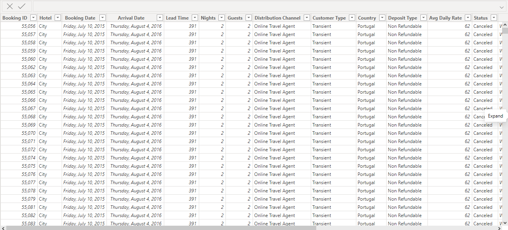
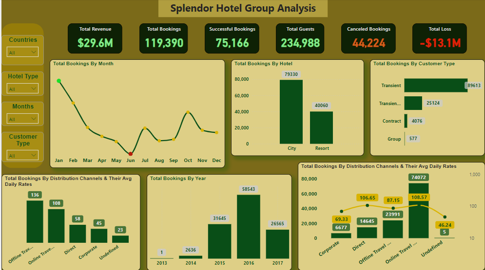
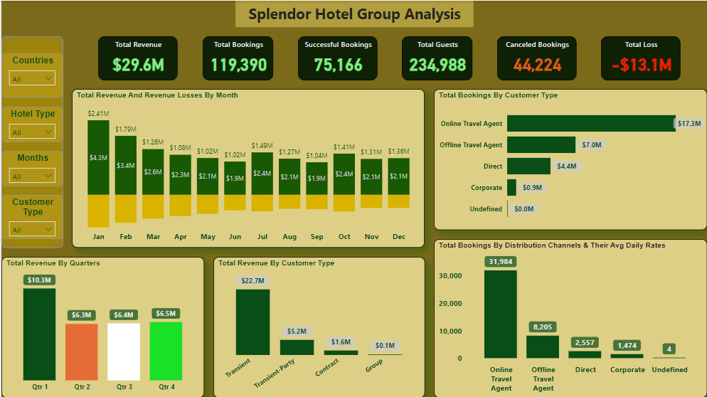

# Splendor-Hotel-Group-Analysis-Using-Power-BI                  

___

### Project Overview

As a Business Intelligence Analyst and Data Analyst, I undertook a comprehensive analysis of historical booking data of Splendor Hotel Groups (SHG) to uncover trends, understand customer behavior, and provide actionable insights to enhance SHG’s strategic decision-making. The dataset included detailed information on bookings, guest demographics, distribution channels, and financial metrics for SHG’s premier resorts.

## Data Sheet

### Objectives of the Analysis

####	Booking Patterns
- **Trend Analysis:** Identified booking trends over time, highlighting peak seasons and months with increased booking activities.
- **Lead Time:** Analyzed lead times across different booking channels and their correlation with customer types.
####	Customer Behavior Analysis
-	**Distribution Channels:** Evaluated which channels contributed the most to bookings and analyzed the Average Daily Rate (ADR) across these channels.
- **Guest Demographics:** Assessed patterns in guest distribution based on country of origin and its impact on revenue.
####	Cancellation Analysis
-	**Predictive Factors:** Identified factors strongly correlated with cancellations and predicted potential cancellations.
-	**Revenue Loss:** Compared revenue loss from cancellations across customer segments and distribution channels.
####	Revenue Optimization
-	**Revenue Trends:** Analyzed overall revenue trends, identifying significant customer segments or countries contributing to revenue.
-	**Pricing Strategies:** Recommended optimal pricing strategies based on ADR for different customer types and distribution channels.
####	Geographical Analysis
-	**Guest Distribution:** Examined the variation in guest distribution across countries to inform targeted marketing efforts.
####	Operational Efficiency
-	**Length of Stay:** Evaluated the average length of stay based on booking channels and customer types.
-	**Resource Allocation:** Identified patterns in check-out dates to inform staffing and resource allocation strategies.
####	Impact of Deposit Types
-	**Deposit Analysis:** Analyzed the impact of deposit types on the likelihood of cancellations and revenue generation.
-	**Segment Patterns:** Identified patterns in the use of deposit types across different customer segments.
####	Corporate Bookings
-	**Corporate Proportion:** Analyzed the proportion of corporate bookings and their ADR compared to other customer types.
-	**Trend Analysis:** Identified trends and patterns related to corporate bookings to inform business strategies.
####	Time-to-Event Analysis
-	**Lead Time Impact:** Investigated the effect of lead time on revenue and the likelihood of cancellations.
-	**Customer Satisfaction:** Identified lead time ranges associated with higher customer satisfaction or revenue.
####	Comparison of Online and Offline Travel Agents
-	**Revenue Contribution:** Compared revenue contributions of online versus offline travel agents.
-	**Cancellation Rates:** Analyzed cancellation rates and revenue variations between online and offline travel agents.

### Tools and Technologies
-	**Data Analysis and Visualization:** Power BI was used for analysis and create an interactive and responsive dashboard.
-	Dashboard Capabilities:** The dashboard featured real-time updates, data filtering capabilities, and essential metrics and KPIs.

### Deliverables
-	**Interactive Dashboard:** A dynamic dashboard showcasing key insights and metrics from the analysis.

## Dashboards

### Key Findings
-	**Seasonal Booking Patterns:** Significant increase in bookings during peak seasons, especially in summer months.
-	**Lead Time Variation:** Shorter lead times were more common with direct bookings, while longer lead times were associated with online travel agents.
-	**Channel Contribution:** Direct bookings and online travel agents contributed the most to bookings, with varying ADRs across channels.
-	**Guest Demographics:** Guests from certain countries showed higher booking rates, influencing targeted marketing strategies.
-	**Cancellation Predictors:** Identified key predictors of cancellations, allowing for proactive management of potential cancellations.
-	**Revenue Insights:** Certain customer segments and countries significantly contributed to overall revenue, guiding pricing strategies.
-	**Operational Efficiency:** Patterns in length of stay and check-out dates provided insights for better resource allocation and staffing.

### Conclusion

This project provided valuable insights into SHG’s booking data, enabling data-driven decision-making to enhance guest experiences and operational efficiency. The interactive dashboard serve as essential tools for SHG’s strategic planning and continuous improvement efforts.

